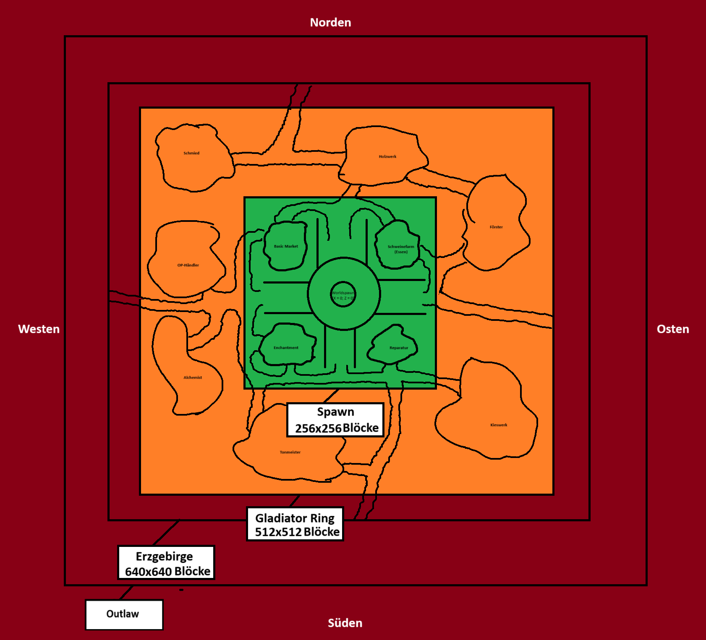

# DBsGameplay Survival
>
> Konzept für den Survival-Modus

<!-- ------------- -->
## Inhaltsverzeichnis

<!-- @import "[TOC]" {cmd="toc" depthFrom=1 depthTo=6 orderedList=false} -->

<!-- code_chunk_output -->

- [DBsGameplay Survival](#dbsgameplay-survival)
  - [Inhaltsverzeichnis](#inhaltsverzeichnis)
  - [2 Grundkonzept](#2-grundkonzept)
    - [2.1 Zonen](#21-zonen)
    - [2.2 PvP](#22-pvp)
    - [2.3 Clans](#23-clans)
    - [2.4 Claim-Obelisk](#24-claim-obelisk)
  - [3 Befehle](#3-befehle)
    - [3.1 /Fill](#31-fill)
    - [3.1 /Auktion](#31-auktion)
    - [3.2 /Bieten](#32-bieten)
    - [3.3 /Vorschau](#33-vorschau)
    - [3.4 /Mülltonne](#34-mülltonne)
    - [3.5 /Confirm](#35-confirm)
    - [3.6 /Cancel](#36-cancel)
    - [3.7 /Chat](#37-chat)
    - [3.8 /Tag](#38-tag)
    - [3.9 /Goldpress](#39-goldpress)
    - [3.10 /Waypoints](#310-waypoints)
    - [3.11 /Kit](#311-kit)
    - [3.12 /Kopfgeld](#312-kopfgeld)
    - [3.13 /Lotterie](#313-lotterie)
  - [X. Denis Vorstellungen](#x-denis-vorstellungen)

<!-- /code_chunk_output -->

---

<!-- ------------- -->
## 2 Grundkonzept
<!-- ------------- -->
### 2.1 Zonen

**Skizze:**

<!-- ------------- -->
### 2.2 PvP
<!-- ------------- -->
### 2.3 Clans
<!-- ------------- -->
### 2.4 Claim-Obelisk
<!-- ------------- -->

---

## 3 Befehle

> Alle Befehle und argumente sind sowohl auf Deutsch als auch auf Englisch verfügbar.

<!-- ------------- -->

### 3.1 /Fill

> Füllt alle Glasflaschen im Spieler-Inventar mit Wasser.

**Syntax:**

- `/fill`
  - Berechtigung: `dbsgameplay.survival.regularplayer.fill`

<!-- ------------- -->

### 3.1 /Auktion

> Ermöglicht es Spielern, Items zur Auktion anzubieten, darauf zu bieten und eine Vorschau des zur Auktion steht.

**Syntax:**

- `/auktion [Mindestgebot]` Erstellt eine Auktion mit dem angegebenen Mindestgebot und dem Item in der Main-Hand des Spielers.
  - Berechtigung: `dbsgameplay.survival.regularplayer.auction`

- `/auktion [on|off]` Schaltet das Auktions-Feature z.B. für ein Event ein- oder aus.
  - Berechtigung: `dbsgameplay.survival.mod.auction.toggle`

- `/auktion abort [Grund]` Bricht die aktuelle Auktion ab und gibt dem ursprünglichem Spieler das Item zurück, falls es z.B. unangemessen benannt wurde.
  - Berechtigung: `dbsgameplay.survival.team.auction.abort`

<!-- ------------- -->

### 3.2 /Bieten

> Bietet Geld auf eine aktive Auktion.

**Syntax:**

- `/bieten [Gebot]`
  - Berechtigung: `dbsgameplay.survival.player.fill`

<!-- ------------- -->

### 3.3 /Vorschau

> Zeigt das zur Auktion stehende Item in einer GUI.

**Syntax:**

- `/vorschau`
  - Berechtigung: `Keine`

<!-- ------------- -->

### 3.4 /Mülltonne

> Gibt dem Spieler eine Mülltonne.

**Syntax:**

- `/trashcan`
  - Berechtigung: `dbsgameplay.survival.team.trashcan`

<!-- ------------- -->

### 3.5 /Confirm

> Universeller Bestätigungs-Befehl für Befehle wie z.B. [3.2 /Bieten](#32-bieten)

**Syntax:**

- `/confirm` Bestätigt einen zuvor ausgeführten Befehl
  - Berechtigung: `Keine`

<!-- ------------- -->

### 3.6 /Cancel

> Universeller Abbrech-Befehl für Befehle wie z.B. [3.2 /Bieten](#32-bieten)

**Syntax:**

- `/cancel` Bricht einen zuvor ausgeführten Befehl ab
  - Berechtigung: `Keine`

<!-- ------------- -->

### 3.7 /Chat

> Schaltet den eigenen Chat ein- oder aus.

- `/chat [on | off | <channel>] <on | off>` Schaltet entsprechende Nachrichtenchannels ein- oder aus.
  - Zusätzliche Informationen:
    - Behält bei `/chat on/off` die Einstellungen der Nachrichtenchannel
  - Berechtigungen:
    - `dbsgameplay.survival.regularplayer.chat`
- `/chat list` Listet alle Nachrichtenchannels auf

**Zusätzliche Informationen:**
Teammitglieder können allen Spielern, unabhängig von ihrem Chattoggle eine Nachricht schicken, in dem sie die Nachricht mit `@a` beginnen und die Berechtigun `dbsgameplay.survival.team.chat.override` besitzt.

<!-- ------------- -->

### 3.8 /Tag

> Gibt dem Spieler ein Chat-Tag, der maximal 6 Zeichen, inklusive Farbcode, umfassen darf.

**Syntax:**

- `/tag [Tag]` Setzt den eigenen Chat-Tag
  - Berechtigung: `dbsgameplay.survival.regularplayer.tag`
- `/tag [Tag] <Spieler>` Setzt den Chat-Tag eines anderen Spielers
  - Berechtigung: `dbsgameplay.survival.team.tag`
- `/tag clear` Leert den eigenen Chat-Tag
  - Berechtigung: `Keine`
- `/tag clear <Spieler>` Leert den Chat-Tag eines anderen Spielers
  - Berechtigung: `dbsgameplay.survival.team.tag`

<!-- ------------- -->

### 3.9 /Goldpress

> Verarbeitet alle Goldnuggets im Inventar des Spielers zu Goldbarren

**Syntax:**

- `/goldpress` Verarbeitet alle Goldnuggets zu Goldbarren

<!-- ------------- -->

### 3.10 /Waypoints

> Zeigt die eigenen verfügbaren Wegpunkte an, zu denen sich der Spieler teleportieren kann.

**Syntax:**

- `/Waypoints` Gibt eine Liste der eigenen Wegpunkte

**Zusatzinformationen:**

Ein Wegpunkt kann erstellt werden, in dem ein Kompass mit 8 Redstone zu einem `Wegpunkt` vercraftet wird und damit auf eine beliebige Position auf den Boden geklickt wird.

<!-- ------------- -->

### 3.11 /Kit

> Gibt dem Spieler eines der Verfügbaren Kits.

**Syntax:**

- `/kits` Öffnet eine GUI/Übersicht aller Kits (Kits können darüber auch erhalten werden)
- `/kit [kit]` Gibt dem Spieler das angegebene Kit
- `/kit gift [Kit] [Spieler]` Schenkt einem anderen Spieler das angegebene Kit

<!-- ------------- -->

### 3.12 /Kopfgeld

> Setzt ein Kopfgeld auf einen anderen Spieler oder Clan aus.

**Syntax:**

- `/kopfgeld [Spieler] [Betrag]` Setzt den angegebenen Betrag als Kopfgeld auf einen Spieler.
- `/kopfgeld [Spieler]` Fragt das Kopfgeld eines Spielers ab.
- `/kopfgeld clan [Clanname] [Betrag]` Setzt den angegebenen Betrag als Kopfgeld auf einen Clan.
- `/kopfgeld clan [Clanname]` Fragt das Kopfgeld eines Spielers ab.

<!-- ------------- -->

### 3.13 /Lotterie

> Startet eine Lotterie, in der drei Spieler die Chance haben Geld zu erhalten.

**Syntax:**

- `/lotterie` Startet eine Lotterie.
- `/lotterie cancel` Bricht eine Lotterie ab.

<!-- ------------- -->

<!-- ------------- -->
<!-- ------------- -->
<!-- ------------- -->

## X. Denis Vorstellungen 

- Spawnbereich
  - Burg als Safe-Zone ([2.1 Zonen](#21-zonen))
- Schlacht-Ring
  - Dorf als "Schlacht Ring" und für Shops/Händler (In den Shops ist PVP aus)
    - Gebäude nach Händler-Theme (Schmiede=Erze, Ingots; Bauernhof=Landwirtschaftl. Produkte)
- Händler für verschiedene Items
  - Schmied (Erze, Ingots, etc.)
  - Holzwerk (Holzerzeugnisse)
  - Förster (Saplings, Roholz)
  - Kieswerk (Grabiges)
  - Alchemist (Tränke & Zubehör)
  - Tonmeister (Baublöcke - (glänzender) Terrakotta, Concrete)
  - OP-Händler (Spezial-Items - Claim-Obelisk)
- 

